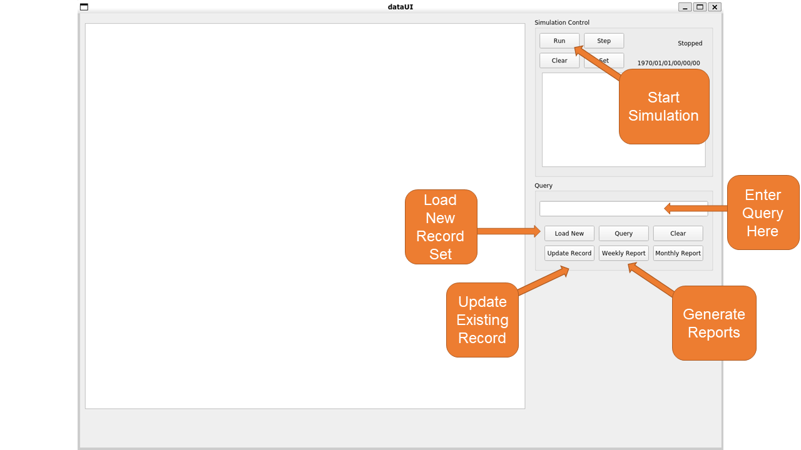
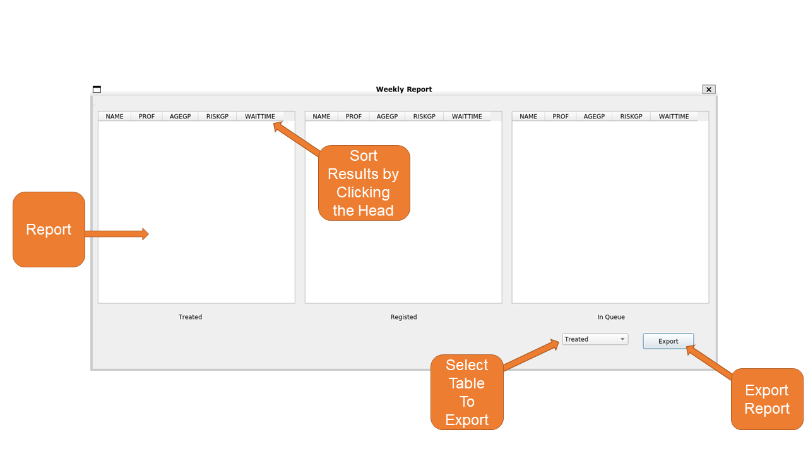
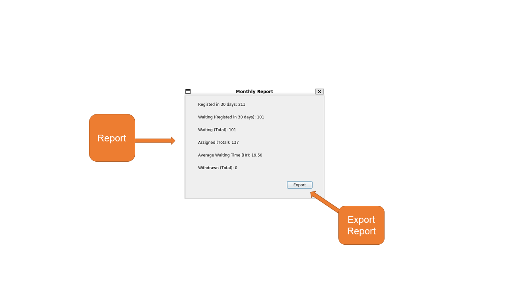

## Computing Assignment 2

##### Above All:

Considering that part of our project cannot be compiled simply with g++/gcc, we have included an executable file. To test the project, please follow the instructions in the [Appendix](#jump).

### Exercise 1: Define and implement the basic data structure for the storage of relations

#### (i)
In the **'SupClass.h'**, we have the four kinds of class for collecting data that we need:

**class Person; class Medical_State; class Registration; class Treatment**;

for every kind of class we can get the information that we need. 

In addition, we can find: **' class Record '** in the **'SupClass.h'**, which can be used for contain all the other 4 kinds of class.

We have four relation, each of which is a mapping, can convert the input *key* into a class, and then continue indexing, until record is returned.      

Our uid is **primary key**, and a uid can index a record; The *person name, medical status and treatment* are all **secondary keys**. In multi-level retrieval, they first retrieve the person, treatment risk level, treatment method and other elements, conduct secondary mapping, index to *uid*, and finally find *record*.

- Example1:   uid=28   ->  recod28 ( contain many types of information )
- Example2:  person_name= Tom, medical_status=3  ->  uid=28 uid=47 ->  record28,record47( This is two record that for Tom, where he have medical_status = 3 ) 

In addition, we build the B-Plus tree for this part to get the information stored, and when we need to collect and store during registration, scheduling and treatment processing. For the detail of the B-plus trees, you can find in the following part, as this part is mainly for the 'class' explanation and more information will be in the next other parts.

#### (ii)
In the **'SupClass.h'** we have a **'class RecordPriority'**, which is used for the three types of treatments a person may register for, each with different priority rules. The main detail of this function can be found in the **RecordPriority.cpp**, and you can get the 3 methods detail in the file. This is for the different priority rules.

The treatments a person may register for, each with different priority rules are:

1. Rule 1: `Priority_Rule1`. The parameter is (const record * a, const record * b);
        If a have higher priority than b, it returns true, otherwise return false.

        1. First, find that whether the two have "isEmergency", which means a Emergency letter.
        the one have isEmergy is higher; 
        if both have "isEmergency", the deadline that is eariler have higher priority.
        
        2. Then, if neither have a Emergency letter, then the risk_gp is used to compare,
        if one have 3 of risk_gp and the other is not 3, 
        the one that have risk_gp that is 3 have a higher priority.
        
        3. Then, if both have risk_gp that are not 3 or that are both 3, compare prof.
        the higher prof have a higher priority.
        
        4. Then, if both prof is the same, compare age_gp;
        where age_gp higher, the priority is higher.


        5. Finally, compare the considertime, 
        and the earlier considertime is the higher priority.
        The comparison method is to return true if b is later than a, otherwise false

2.  Rule 2: `Priority_Rule2`. The parameter is (const record * a, const record * b);
        If a have higher priority than b, it returns true, otherwise return false

        1. First, find that whether the two have "isEmergency", which means a Emergency letter.
        the one have isEmergy is higher; 
        if both have "isEmergency", the deadline that is eariler have higher priority.
        
        2. Then, if neither have a Emergency letter, then the risk_gp is used to compare,
        the one have smaller risk_gp is higher.
        
        3. Then, if both have same risk_gp, compare prof.
        the SMALLER prof have a higher priority.
        
        4. Then, if both prof is the same, compare age_gp;
        where age_gp SMALLER, the priority is higher.
        
        5.  Finally, compare the considertime, 
        and the earlier considertime is the higher priority.
        The comparison method is to return true if b is later than a, otherwise false

3.  Rule 3: `Priority_Rule3`. The parameter is (const record * a, const record * b);
        If a have higher priority than b, it returns true, otherwise return false

        1. First, compare age_gp;
        where age_gp larger, the priority is higher.
        
        2. Then if they have same age_gp, compare risk_gp, 
        the one have smaller risk_gp have the higher priority.
        
        3. Then if they have same risk_gp, compare considertime,
        the one have eariler considertime have higher priority.
        
        4. Then if they have same considertime, compare status,
        the one have smaller status have higher priority.
        
        5. Finally, if a have larger prof than b, then consider that a have higher Priority than b,
        otherwise, consider that b have higher Priority than a.


#### (iii)
As we can find that in the previous part, we can get that: the main storage of the relations are the B-plus trees part. For the B-plus tree, we can get that all the data that we need are all in the leaf node part, and we can find that all the leaf nodes are linked together and this is the array that we need. 

We have a sequence of uid stored in the block. If we need multi-level index, just  uses **union or intersection**. Every time you insert/delete, we need to change the blocks of **name, medical_status,treatment,registation**.

- Example: The user want to check the record of Tom under the status of: medical status=3 

  1. The key: Tom have mapping on the relation of name to get a sequence of$uid_1=[3,5,16,28,47]$

  2. 3, which is key of medical_status relation, can used to mapping to get$uid_2=[1,2,4,6,8,9,12,14,28,32,36,47]$

  3. $uid_1\cap uid_2=[28,47]$

  4. Finally we get records?that are$record_{27},record_{28}$

For the four relations: *class Person; class Medical_State; class Registration; class Treatment*, we can get that: for everyone of them, we have a B-tree and we can get the data stored using an ordered sequence of blocks, where each block is realised by an array.


#### (iv): Overflow

In the NodeBlock you can find that, under the **`class LeafNode:public BPlusNode`**,

 we defined the **`vector< pair<K,T*> > overflow_block`** and the **`int overflow_num`**, **`int overflow_size`**. In addition we have this used, permit an additional overflow block for each block in the sequence. We directly use vector as overflow block. 

#### (v)
For the insertion, deletion, merging, sorting, splitting, retrieval, you can find them in the:

**`BPlus_multi.h`**, **`BPlus.h`**, **`NodeBlock.h`**.

For example, in the `BPlus.h` we can have `class BPlusTree`. For the class we have functions: 

`Insert, Insert_InternalNode, Find, Range, SearchLeafNode, Delete, Delete_InternalNode, ClearTree, PrintTree, PrintNode, PrintData, CheckNode, Get_root, Set_root,  Get_depth`.

and in the `NodeBlock.h` we also have `class LeafNode`, which contain:

`Get_key, Set_key, Set_ptr, Get_ptr, Get_Data, Insert, Delete, Split, Combine, MoveOneElement, comp`.

If more information is needed, you can compile **`B+Test.cpp`** by `make BM` and `make BT` to get the B_plus trees tested.


### Exercise 2:

1. The main part that we use to simulate is in the `Simulator.cpp` and `Simulator.h`, this is for the file output for the various reports and modify the operations for registration, priority calculation, appointment scheduling and reporting using the database schema.

2. The file output can be obtained by sending queries to the database access and we get the result. See GUI Instruction Attached. This part is realized in `./ui/dataUI/weeklyreportshow.cpp` as well as `./ui/dataUI/monthlyreport.cpp`.

#### Some Supporting functinos:

1. Add data from file:`int Put(string filename)`

The interface should read record from an original record table file. And establish the corresponding index in datastorage. Note that the uid, status and other information should be initialized.If it is successful, it returns 0. If the file does not exist, it returns 1 for reading error and 2 for other errors

2. Update data from file:`int UpdateData(string filename)`

The interface should read the record from an update record table file and update the corresponding index in datastorage. Be careful not to add indexes that are not updated repeatedly. Ignore records that do not exist and need to be updated.

If it is successful, it returns 0. If the file does not exist, it returns 1 for reading error and 2 for other errors.

3. Update information exposure:
`std::list<Record*> newrecords`
`std::list<Record*> updatedrecords` 

### Exercise 3:

#### (i): Identifications of Relations
The Record of the BPlus trees:

    static BPlus<unsigned long, Record> recstore_uid;   //Record primary key (UID)BPlus tree
    static BPlus_multi<string, Record> recstore_id;     //Record secondary keys (ID)BPlus tree
    static BPlus_multi<int, Record> recstore_prof;      //Record secondary keys (PROF)BPlus tree
    static BPlus_multi<int, Record> recstore_status;    //Record secondary keys (STATUS)BPlus tree
    static BPlus_multi<int, Record> recstore_riskgp;    //Record secondary keys (RISKGP)BPlus tree
    static BPlus_multi<int, Record> recstore_agegp;     //Record secondary keys (AGEGP)BPlus tree
    static BPlus_multi<DateTime, Record> recstore_regtime;  //Record secondary keys (REGTIME)BPlus tree
    static BPlus_multi<DateTime, Record> recstore_quetime;  //Record secondary keys (QUETIME)BPlus tree
    static BPlus_multi<int, Record> recstore_treattp;   //Record secondary keys (TREATTP)BPlus tree
    static BPlus_multi<DateTime, Record> recstore_asstime;  //Record secondary keys (ASSTIME)BPlus tree
    static BPlus_multi<DateTime, Record> recstore_tretime;  //Record secondary keys (TRETIME)BPlus tree
    static BPlus<string, Record> personstore_ID;        //Personprimary(ID)BPlus tree
    static BPlus_multi<DateTime, Record> personstore_birth; //Person secondary keys (BIRTH)BPlus tree
    static BPlus_multi<int, Record> personstore_prof;   //Person secondary keys (PROF)BPlus tree

We can retrieve a record using different keys as index by using different trees. 

#### (ii): Primary key structure

For primary key, we use uid(a specific unsigned integer assigned autonomously by program when someone registers). The B+ Tree *BPlus<unsigned long, Record> recstore_uid*  will be the index structure for primary key.

#### (iii): Operations from Exercise 1
As shown in Ex.3 (i), we build different B+ trees for different indices. ID, PROF are for person relations. STATUS, RISKGP, AGEGP are for medical status relations. REGTIME, QUETIME are for registration relations. TREATTP, ASSTIME, TRETIME are for treatment relations. Our B+-trees stores the whole record indexed at a specific key. 

For the three treat types, we used TREATTP=0,1,2 to represent, and look for a specific type by searching in **recstore_treattp** with index 0,1,2.

For the retrieval of a record from a relation, we apply logic statement. There are nine patterns. (The order has a little differnet in the Calc.cpp(Or Calc_p.cpp)'s comment)
For all the relations, we apply Range(L,R,b_min,b_max) Or Find for equation in the corresponding key's B+ tree. b_min, b_max represents whether retreive the endpoint index.
```
 1. KEY < CONST                 // Apply Range(-∞, CONST, 0, 0)
 2. KEY <= CONST                // Apply Range(-∞, CONST, 0, 1)
 3. KEY > CONST                 // Apply Range(CONST, +∞, 0, 0)
 4. KEY >= CONST                // Apply Range(CONST, +∞, 1, 0)
 5. KEY == CONST                // Apply Find(CONST)
 6. CONST1 < KEY < CONST2       // Apply Range(CONST1, CONST2, 0, 0)
 7. CONST1 <= KEY < CONST2      // Apply Range(CONST1, CONST2, 1, 0)
 8. CONST1 < KEY <= CONST2      // Apply Range(CONST1, CONST2, 0, 1)
 9. CONST1 <= KEY <= CONST2     // Apply Range(CONST1, CONST2, 1, 1)
```
We represent -∞ and +∞ by storing a minDateTime, maxDateTime, minstring, maxstring, minint, maxint, minUint and maxUint first.

Other details (Ex.1(iii),(iv), and the first two lines of (v)) are stated in Ex.1 corresponding place.

#### (iv): Secondary key structure

For secondary key, since our program needs a lot range operations in order to finish users’ query requirement, we decided to use B+ Tree instead of B Tree due to efficiency. This time, we will use B+ Tree_multi to store secondary key and data. This is because one secondary key may be related to many different registration. For example, if user search for name\==Jack, our program should find all the registrations with the property name==Jack. In this B+ Tree_multi, we store a vector in each block’s entry. In this way, we can search a range of data in a very fast speed and return a bunch of data correspondingly.

#### (v): Operations from Exercise 2

For (v), our implementation is in ```DataInterface.cpp```.

1. Add data from file:`int Put(string filename)`

After extracting the string in each line, we should apply the insertion operation to every kind of index. That is, applying ```Insert``` to each B+ tree for adding the same record with corresponding index.

2. Update data from file:`int UpdateData(string filename)`

The file will update a specific key for several records. If we don't need to update(the new value equals to the old), just skip the step. Otherwise, we apply ```Insert``` again with the new value as the index to the corresponding B+ tree.


<span id="jump"></span>

### Appendix: GUI Instruction

To facilitate testing and data visualization, we developed a GUI for our project.
This GUI is developed with QT5. To excecute the GUI, direct the current path to "./dataUI_t" by `cd ./dataUI_t` and then type `./dataUI.sh`. Before that please give execution permission to both `./dataUI.sh` and `./dataUI`.

We recommand that you run the GUI in Ubuntu Desktop 20.01 or higher. The GUI will fail to launch in WSL without remote graphic support.

All the source files of GUI locate at `./ui/dataUI `. You can compile the source files with QT5 IDE.

For data updating tables, like new patients registration, a Emergency letter, we just need to use the GUI to input. The input time is same to the time that we have on the GUI, and for withdraw, input the command **d(withdraw) -u uid** instead of using updating tables. The test data examples and letter example is in the *Test_data* File Folder.
#### 1.Main Form


#### 2.Weekly Report


#### 3. Monthly Report


Sample queries can be found in `Execute.md`

Simulator Class can be tested by `make Simulator`